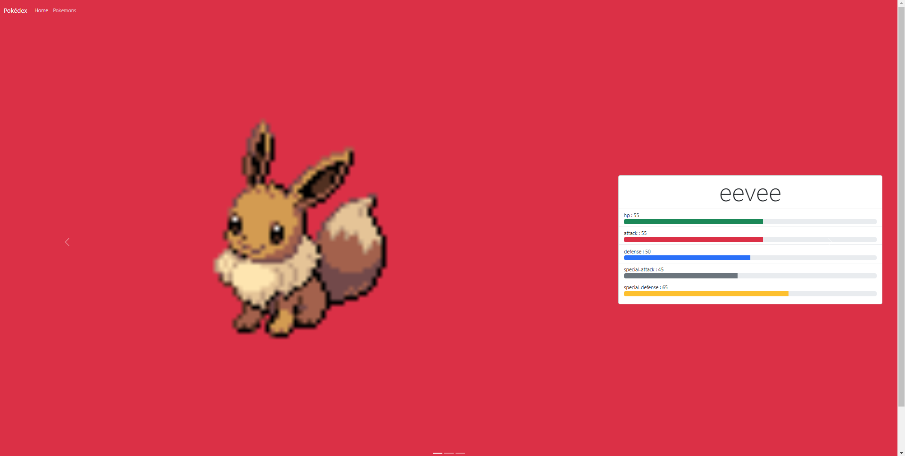
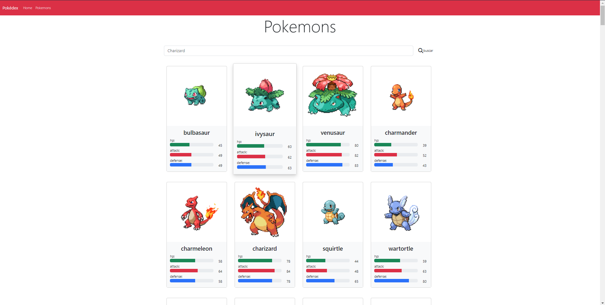
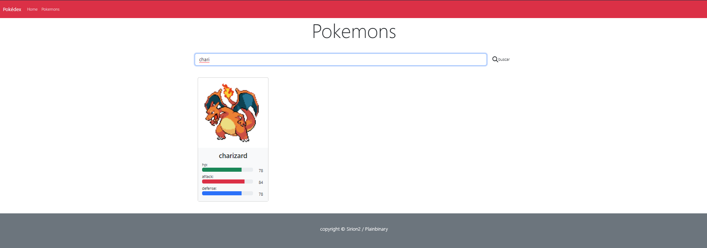
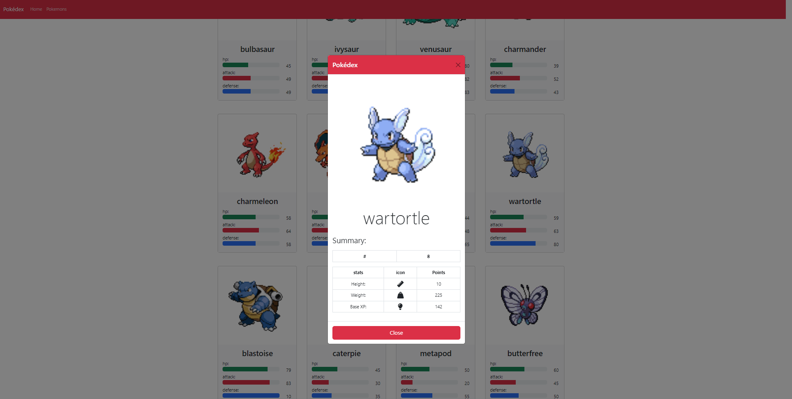

## Pokedex
Aplicación para el consumo de la primera generación de pokemones.

## Herramientas Utilizadas:
- [x] Angular.
- [x] TypeScript.
- [x] Bootstrap.

## Caracteristicas:
La aplicación está desarrollada para su rapido uso mendiante una barra de busqueda el cual el usuario puede consultar su pokemon deseado.

## Secciones:
- NavBar
- Home
- Pokemons
- Pokemon Stats
- Footer

## Interfaz de Usuario:
La aplicación cuenta con los siguientes objetos:

1. **NavBar:**  Barra de navegacion para fácil acceso al usuario.
    

2. **Home:**    Muestra uno random de la primera generacion y sus stats.
    

3. **Pokemons:**    Muestra el catalogo de pokemones al usuario.
    

4. **Pokemons:**    Permite una busqueda fácil e intuitiva al usaurio mediante una barra de busqueda.
    

5. **Pokemon Stats:**   Muestra los stats del pokemon seleccionado mediante una card.
    

6. **Footer:**  Muestra el autor del proyecto.
    